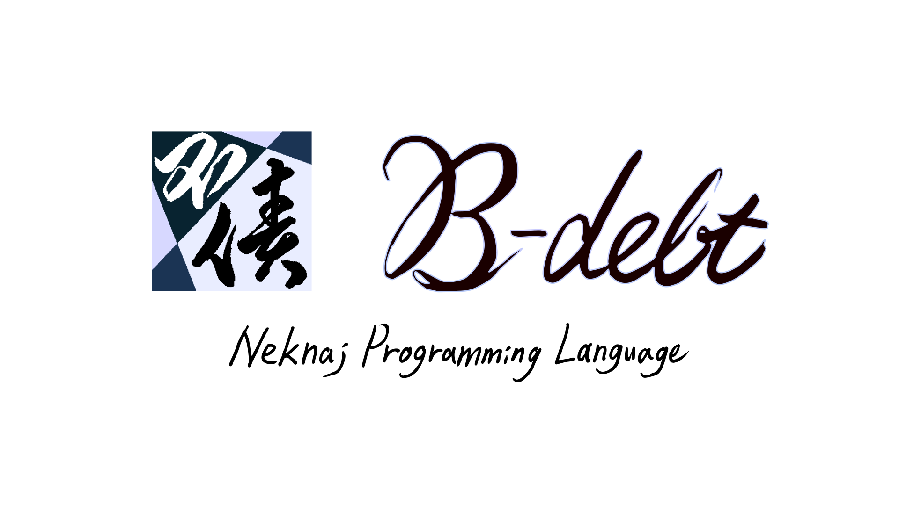

# B-debt - Neknaj Language Processing System

Bem130が作り直し続けているプログラミング言語、B-debtとその処理システム  
コンソールアプリです  




スクリーンショット


## 使い方
ファイルから入力
第一引数にファイルパスを渡します
```bash
& path_to_thisapp file
```
標準入力から入力
リダイレクトを使って標準入力から入力できます  
```bash
& echo program >> path_to_thisapp
& path_to_thisapp < file
```

リダイレクトを使わずに標準入力に直接キーボード入力もできます  
入力を終了するには`#EOINPUT`を入力します  
これは入力が標準入力の時のみ有効で、ファイルから入力の際は普通のコメントとして扱われます  
```
& path_to_thisapp
```


## 前回のリポジトリ

一応これの後継ですが実装は全く違います  
https://github.com/neknaj/nlps  
